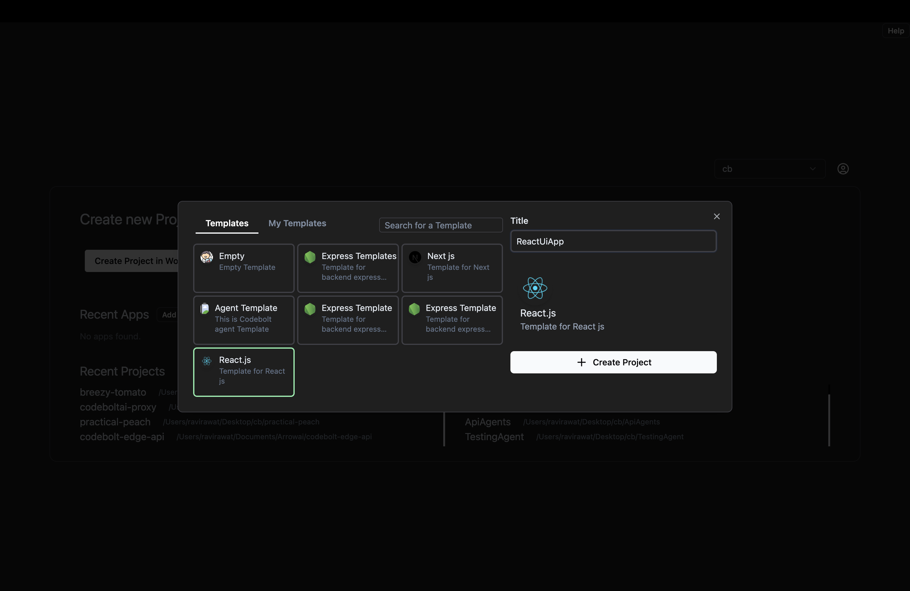
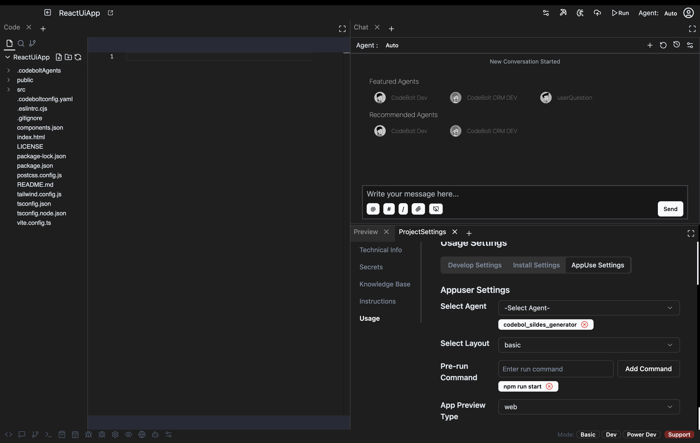
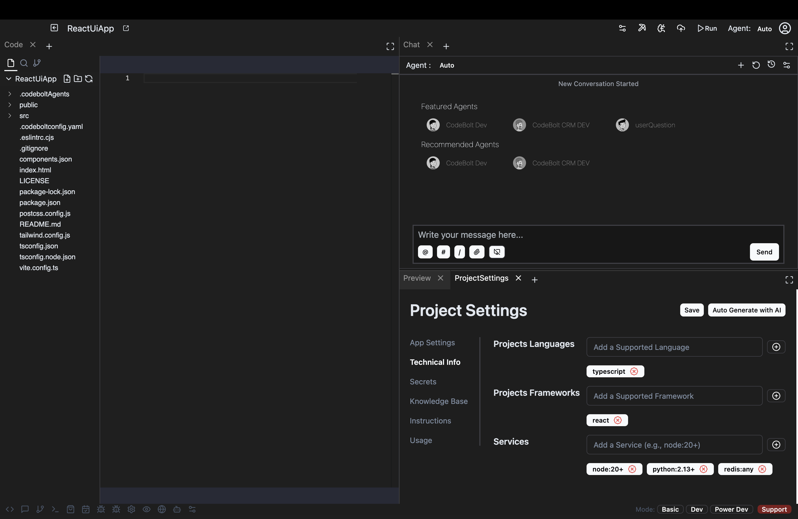
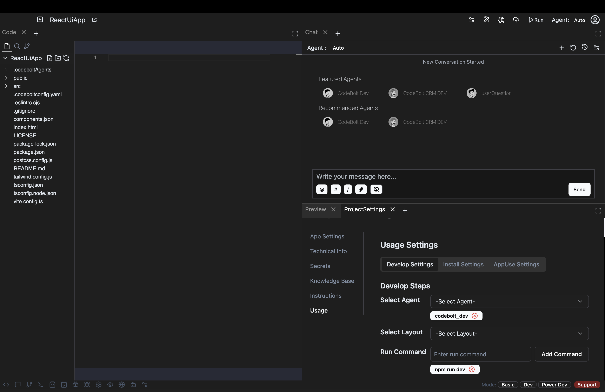
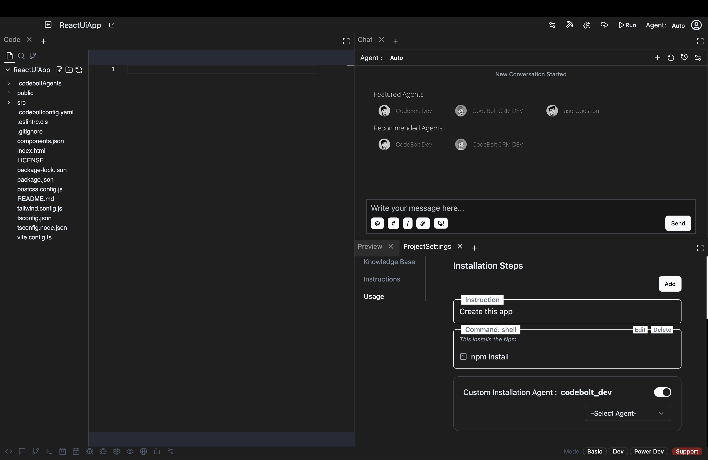
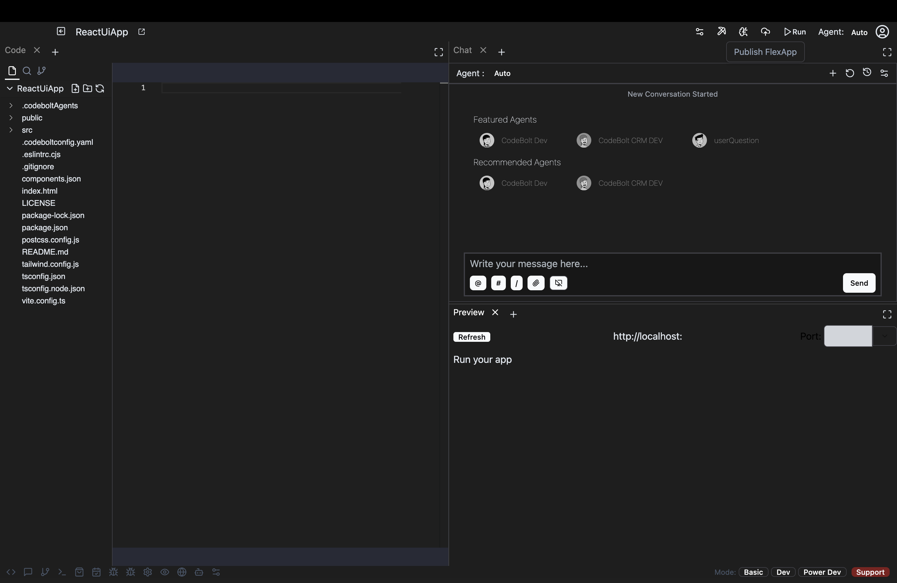
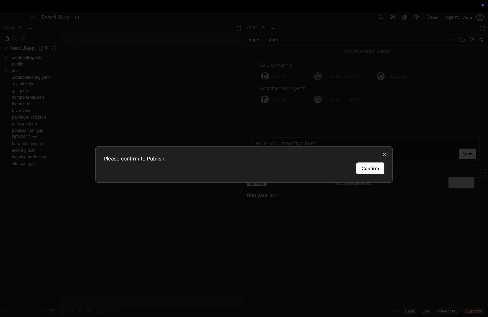
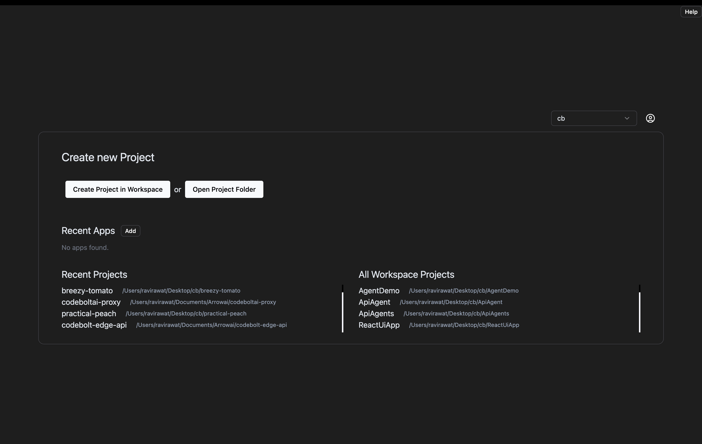

# Publish Your First App

This guide walks you through the process of publishing your application using Codebolt.

## Step 1: Create Your Application
1. Navigate to the application creation interface
2. Configure your application's basic settings
3. Confirm the creation process

## Step 2: Configure Application Settings
1. Set up all application-related configurations
2. Define the required parameters for your application

## Step 3: Provide Technical Information
1. Fill in all technical details about your application
2. Include system requirements and compatibility information

## Step 4: Configure Development Settings
1. Set up your development environment parameters
2. Define build and deployment configurations

## Step 5: Configure Installation Settings
1. Specify installation requirements and procedures
2. Define any pre-installation or post-installation steps

## Step 6: Configure Application Usage Settings
1. Define how users will interact with your application
2. Set up any required user permissions or access controls

## Step 7: Publish Your Application
1. Review all settings and configurations
2. Click the "Publish" button to make your application live

## Step 8: Verify Your Application Structure
1. Review the final application structure
2. Confirm all components are properly configured

## Step 9: Find Your Application
1. Locate your newly created application

