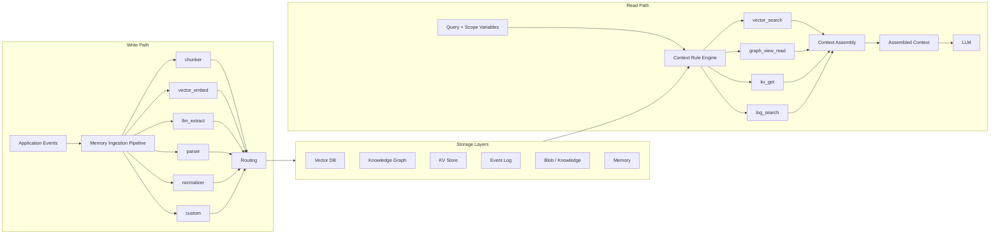

# Memory Management & Optimization

Codebolt exposes the full memory stack as a **programmable API surface**. Agents, action blocks, and hooks can read and rewrite every part of the memory system at runtime — the ingestion pipelines that write data, the persistent memory definitions that retrieve it, the context rules that govern what reaches the LLM, and the raw storage in the vector store, knowledge graph, and KV store.

This section is for builders who need to go beyond the default behaviour — tuning how their agents learn, what they remember, and how efficiently context is assembled.

## Architecture

The memory system has two main data paths — a **write path** that ingests and stores information, and a **read path** that retrieves and assembles it into LLM context. Both paths share a common set of storage layers.

The **write path** accepts events from application code, agent actions, or hooks. Each event flows through a configurable ingestion pipeline whose processors — `chunker`, `vector_embed`, `llm_extract`, `parser`, `normalizer`, or `custom` — transform the data before routing it to one or more storage layers.

The **read path** starts with a query and a set of scope variables. The context rule engine evaluates which persistent memory pipelines to activate (`vector_search`, `graph_view_read`, `kv_get`, `log_search`), executes them against the storage layers, and feeds the results into context assembly. The assembled context is what ultimately reaches the LLM.

## The Memory Stack

Codebolt's memory system comprises nine components grouped into three categories: storage layers, a write path, and a read path.

### Storage Layers

| Component | Purpose | SDK Module | UI Panel | REST Base Path |
|---|---|---|---|---|
| [Vector DB](./02a_vector-db.md) | Semantic search over embeddings | `codebolt.vectordb` | Vector DB | `/vectorDB` |
| [Knowledge](./02b_knowledge.md) | Document chunking and management | — | Knowledge | `/knowledge` |
| [Knowledge Graph](./02c_knowledge-graph.md) | Typed nodes, edges, and Cypher-like views | `codebolt.knowledgeGraph` | Knowledge Graph | `/kg` |
| [KV Store](./02e_kv-store.md) | Fast namespaced key-value storage | `codebolt.kvStore` | KV Store | `/kvstore` |
| [Event Log](./02e_kv-store.md) | Immutable event timeline | `codebolt.eventLog` | Event Log | `/eventlog` |
| [Episodic Memory](./02_runtime-memory-apis.md#episodic-memory--codeboltepisodicmemory) | Thread-based append-only event logging | `codebolt.episodicMemory` | Episodic Memory | `/memories/episodic` |
| Memory | Human-readable notes and records | `codebolt.memory` | Memory | `/memories` |

### Write Path

| Component | Purpose | SDK Module | UI Panel | REST Base Path |
|---|---|---|---|---|
| [Memory Ingestion](./02f_memory-ingestion.md) | Event-driven pipelines that transform and route data into storage | `codebolt.memoryIngestion` | Memory Ingestion | `/memory-ingestion` |

### Read Path

| Component | Purpose | SDK Module | UI Panel | REST Base Path |
|---|---|---|---|---|
| [Persistent Memory](./02d_persistent-memory.md) | Declarative retrieval pipeline definitions | `codebolt.persistentMemory` | Persistent Memory | `/persistent-memory` |
| [Context Assembly](./02g_context-assembly.md) | Rule engine + multi-source context orchestration | `codebolt.contextAssembly` | Context Assembly | `/context-assembly` |

## What you can do at runtime

| Operation | API surface |
|---|---|
| Create or reconfigure an ingestion pipeline | `codebolt.memoryIngestion` |
| Add, update, or remove entries in any storage layer | `codebolt.kvStore` · `codebolt.vectordb` · `codebolt.knowledgeGraph` · `codebolt.memory` |
| Modify persistent memory retrieval pipelines | `codebolt.persistentMemory` |
| Update context rules dynamically | `codebolt.contextRuleEngine` |
| Assemble context on demand for any query | `codebolt.contextAssembly` |
| Record structured events to episodic memory | `codebolt.episodicMemory` |
| Trigger memory processing via lifecycle hooks | Hook system (`.codebolt/hooks/`) |
| Run arbitrary code in the ingestion pipeline | Custom processors / action blocks |
| Measure and improve memory quality | Eval & optimization system |

## Why agents modify their own memory

Static memory configurations work for predictable workflows. For agents that operate in varied or evolving environments, **self-modifying memory** is a better fit:

- An agent learns a user's naming conventions mid-conversation and writes them to KV so future runs respect them without prompting.
- An orchestrator discovers a sub-agent repeatedly failing on a class of task and writes a corrective heuristic to a persistent memory pipeline.
- A long-running agent compresses its episodic history into vector embeddings after each session so context stays lean.
- A quality-monitoring agent evaluates its own retrieval results and adjusts the `topK` and `minScore` of its vector search steps.

All of this is done through the same SDK that external code uses — agents are not privileged. The boundary is the storage layer, not the caller.

## In this section

**Component deep-dives:**
- [Vector DB](./02a_vector-db.md) — SQLite + sqlite-vec, hybrid search, AST-aware chunking
- [Knowledge](./02b_knowledge.md) — document management, 6 chunking strategies
- [Knowledge Graph](./02c_knowledge-graph.md) — Kuzu DB, schema templates, Cypher-like views
- [Persistent Memory](./02d_persistent-memory.md) — declarative retrieval pipelines, 21 step types
- [KV Store](./02e_kv-store.md) — namespaced key-value storage, query DSL
- [Memory Ingestion](./02f_memory-ingestion.md) — event-driven write pipelines, 8 processors, 5 destinations
- [Context Assembly](./02g_context-assembly.md) — rule engine, parallel retrieval, token budgeting

**SDK & automation:**
- [Runtime memory APIs](./02_runtime-memory-apis.md) — complete SDK reference for all memory modules
- [Hooks and action blocks](./03_hooks-and-action-blocks.md) — event-driven memory automation

**Quality & optimization:**
- [Memory evaluation](./05_memory-evaluation.md) — measuring retrieval quality and running optimization loops
- [Optimization patterns](./06_optimization-patterns.md) — pruning, compaction, summarization, and self-tuning

**Visual management:**
