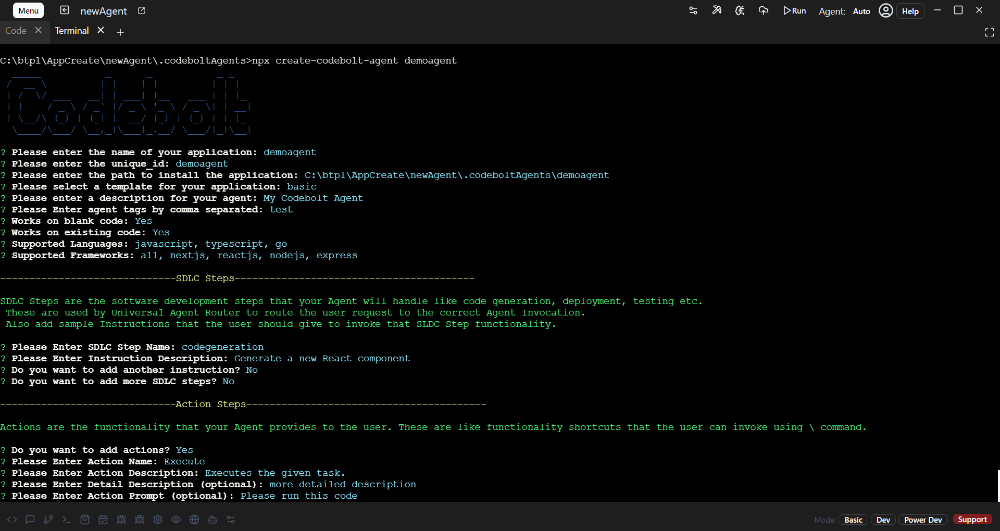

# Create your First Agent


## Create Codebolt Agent

Follow the steps below to create a new agent using Codebolt.

### Step 1: Choose Your Method to Create an Agent
- **Option 1: Use Agent Template**  
  Open Codebolt Application. Create Project In Workspace >  Select Agent Template > Create Project
  

- *Navigate to the .codeboltAgents directory.*
   ```bash
      cd .codeboltAgents
   
   ```

- **Option 2: Use Npx Command**  
  Open your terminal in the directory where you want the agent to be created and run the following command:  
  ```bash
  npx create-codebolt-agent your-agent-name
  ```



### Step 2: Fill in the Required Information
After running the command, you'll be prompted to provide several details. Here are the inputs you need:

- Application Name: The name of your application **(e.g., myagent)**. 
- Unique ID: A unique identifier for the agent **(e.g., myagent)**.
- Installation Path: The path where your agent will be installed **(e.g., C:\btpl\codeboltapp\crud\myagent)**.
- Template: Select a template for your application **(e.g., basic)**.
- Description: Provide a description for your agent **(e.g., My Codebolt Agent)**.
- Tags: Enter tags for your agent **(comma-separated, e.g., test)**.
- Works on Blank Code: Choose **Yes** if your agent works on blank code.
- Works on Existing Code: Choose **Yes** if your agent works on existing code.
- Supported Languages: Specify the languages your agent will support **(e.g., all, javascript, typescript)**.
- Supported Frameworks: Select the frameworks your agent will support **(e.g., all, nextjs)**.

- **Step 3: Configure SDLC Steps**

- The SDLC (Software Development Life Cycle) steps define what tasks your agent will handle **(e.g., code generation, deployment)**. Here's an example configuration:

- **SDLC Step Name: codegeneration**
- Instruction Description: Generate a new React component
Once you've provided these details, you'll be asked if you want to add more SDLC steps. Choose No if you don’t need additional steps.

- **Step 4: Add Action Steps**
Actions represent the functionalities your agent provides. For example:

- Action Name: **Execute**
- Action Description: **Executes the given task**
- Detail Description (Optional): **more detailed description**
- Action Prompt (Optional): **Please run this code**
- You can add more actions if needed.