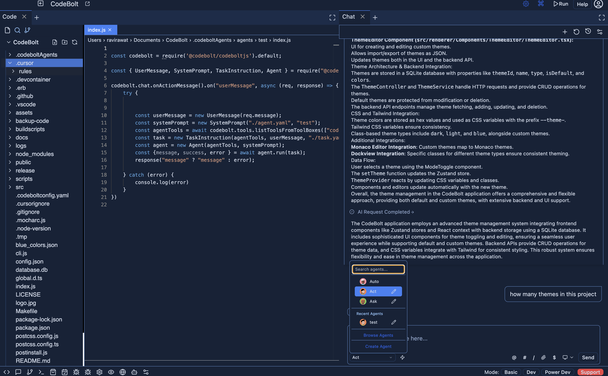

# Create your First Agent

## Create Codebolt Agent
Follow the steps below to create a new agent using Codebolt.

### Step 1: Select or Create a Project for Agent Creation

  

- *After creating or opening a project, open a terminal to create an agent.*

### Step 2: Initialize the Agent Creation Process

1. Open your terminal in the project directory
2. Type the following command:
   ```bash
   npx codebolt-cli createagent demoAgent --quick
   ```
 
   
3. Press Enter to execute the command

   - `demoAgent`: This is the name of your agent (can be customized)
   - `--quick`: This flag creates a basic agent template with default configurations
### Step 3: Understanding the Agent Structure

After successful creation, your agent will have the following structure:
```
.codeboltAgents/
└── demoAgent/
    ├── codeboltagent.yaml       # Agent configuration file
    ├── agent.yaml        # contains Prompt for agent
    ├── task.yaml          # contains instruction for task
```

### Step 4: Verify Agent Creation

- *After successfully creating the agent, you can find your agent inside the .codeboltAgents folder.*
  

### Step 5: Next Steps

1. Open the `codeboltagent.yaml` file to customize your agent's settings
2. Configure your agent's prompt in the `agent.yaml` file
3. Define tasks and instructions in the `task.yaml` file
