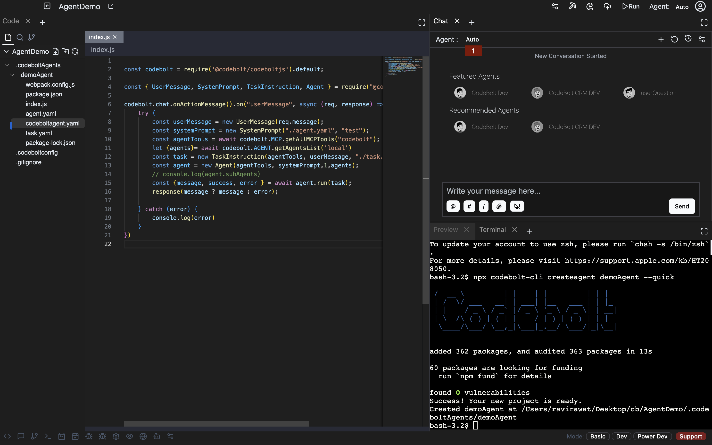
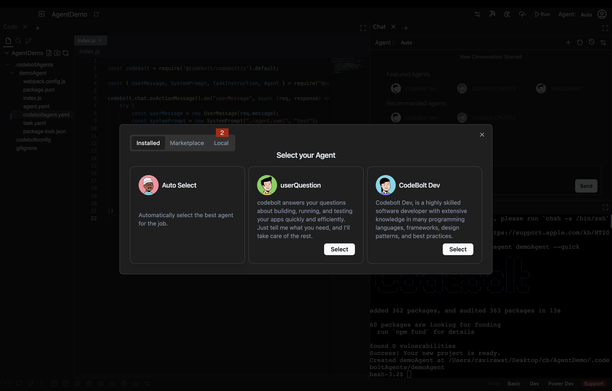
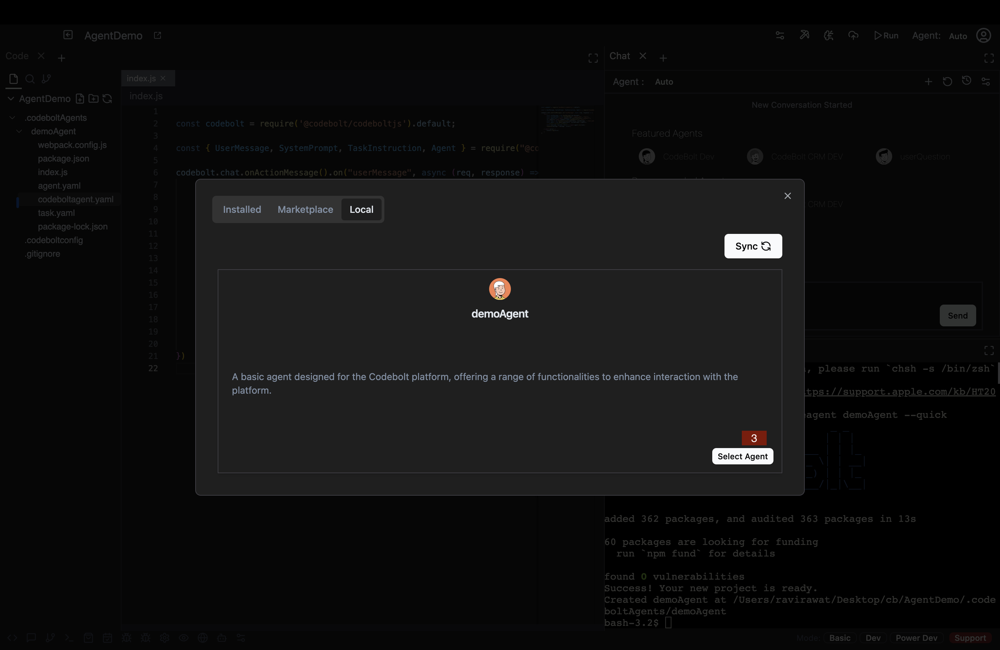
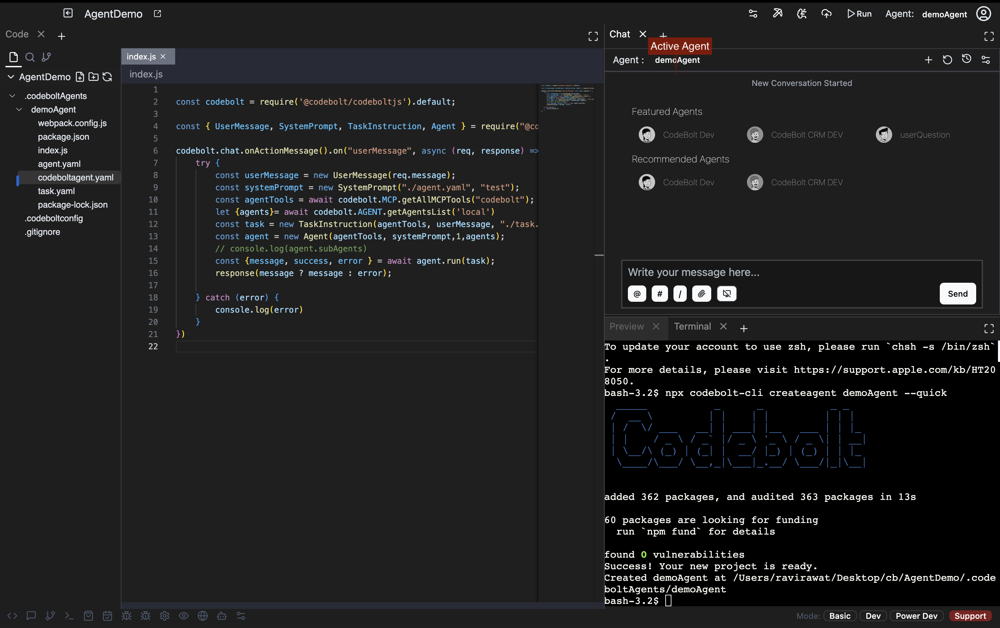

# Run Local Agent in Codebolt

This guide will walk you through the process of running a local agent in Codebolt. Local agents allow you to use custom-built AI assistants directly within your development environment.

## Step-by-Step Guide

### 1. Access the Agent Menu
- Open Codebolt and locate the "Agent" section in the main toolbar
- Click on the "Agent: auto chat" header to open the agent selection menu

### 2. Navigate to Local Agents
- In the popup window, you'll see three tabs:
  - **Installed**: Shows currently active agents
  - **MarketPlace**: Contains pre-built agents available for download
  - **Local**: Displays agents stored on your machine
- Click on the "Local" tab to view your available local agents

### 3. Select Your Agent
- Browse through the list of local agents
- Each agent will display its name and basic information
- Click on the agent you want to activate

- After selection, the selected agent will be activated.

## Troubleshooting Tips
- If you don't see your local agent:
  - Verify the agent files are in the correct directory
  - Restart Codebolt and try again
