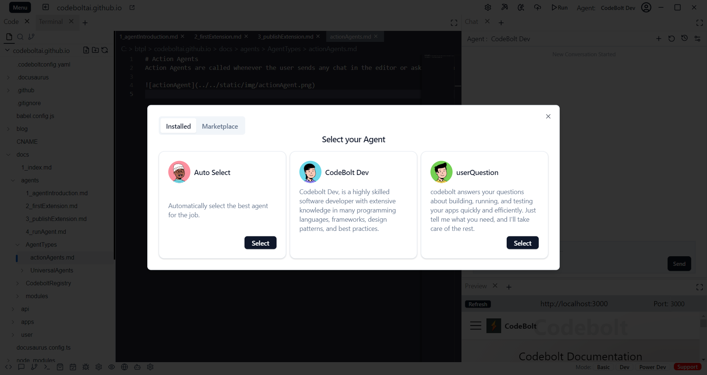
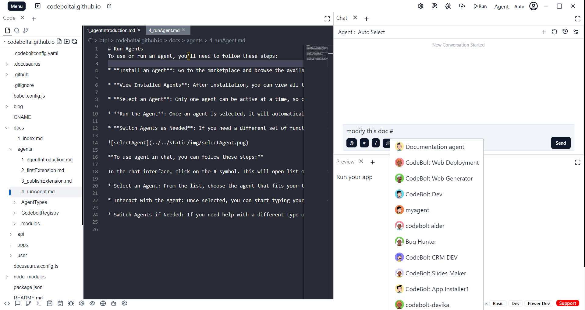

# Run Agents
To use or run an agent, you’ll need to follow these steps:

* **Install an Agent**: Go to the marketplace and browse the available agents. Once you’ve found the agent you want to use, install it. Installation will add the agent to your Installed agents, making it available for activation.

* **View Installed Agents**: After installation, you can view all the agents in your Installed Agents. This allows you to manage which agents are currently installed and ready for use.

* **Select an Agent**: Only one agent can be active at a time, so choose the one best suited to your current task. Selecting an agent will activate it, meaning it will respond to relevant commands or actions you initiate in the editor.

* **Run the Agent**: Once an agent is selected, it will automatically activate in response to specific commands or tasks related to its function. For example, if you’re using CodeBolt Dev, you can can put your prompts in the chat, and the agent will respond with suggestions, error checks, or refactoring options.

* **Switch Agents as Needed**: If you need a different set of functions, return to your agent list to deactivate the current agent and select another. For instance, if you’re done with development and need to deploy, switch from CodeBolt Dev to CodeBolt Web Deployment for automated deployment support.

**To use agent in chat, you can follow these steps:**

In the chat interface, click on the `# symbol`. This will open list of all available agents.

* **Select an Agent**: From the list, choose the agent that fits your task or query. For example, if you’re working on deployment, you might select CodeBolt Web Deployment.

* **Interact with the Agent**: Once selected, you can start typing your query or command directly in the chat. The agent will process your request and respond based on its functionality.

* **Switch Agents if Needed**: If you need help with a different type of task, click # again to open the agent list, select another agent, and start your next interaction.

