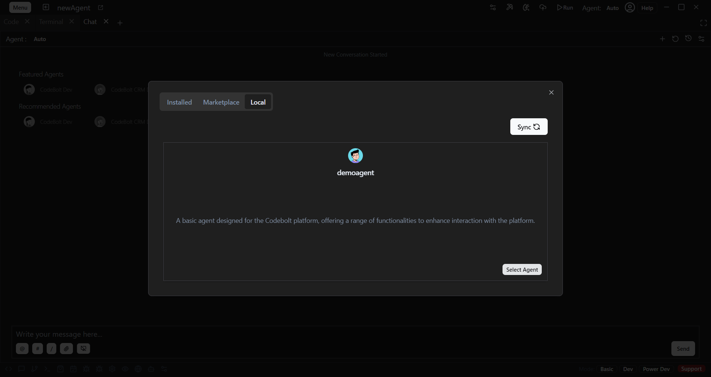

# Run Agent Locally

## how to run agent Locally

Follow the steps below to run a new agent locally Codebolt.

### Click On Agent: auto chat header

- *After clicking on Agent: auto, a popup will appear*

- *The popup will have 3 categories: Installed, MarketPlace, and Local*

- *Click on the Local category*

- *Select your desired local agent*

