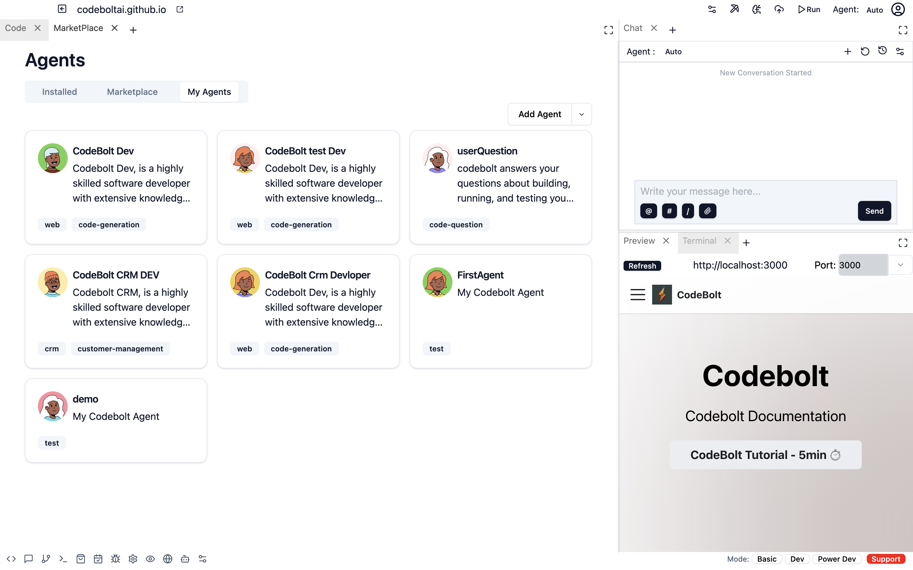

# Run Agent Locally

## how to run agent Locally

Follow the steps below to run a new agent locally Codebolt.

### Step 1: Click On marketplace icon in buttom bar

### Step 2: Click On My Agents

- **Click on "Add Agent"**
- **Choose the folder containing the agent**
- **The agent will be set up on your local machine**

