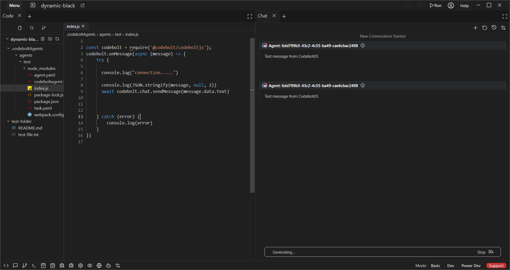

---
data:
  name: processStarted
  category: chat
  link: processStarted.md
cbbaseinfo:
  description: >-
    Notifies the server that a process has started and sets up an event listener
    for stopProcessClicked events.
cbparameters:
  parameters: []
  returns:
    description: An object containing the event emitter and a stopProcess method.
    typeArgs: []
---
<CBBaseInfo/> 
 <CBParameters/>


### Example 

```js
// Notify the server that a process has started
await codebolt.chat.processStarted();
```



### Explanation
The codebolt.chat.processStarted() function is used to notify the Codebolt chat that a specific process has started.