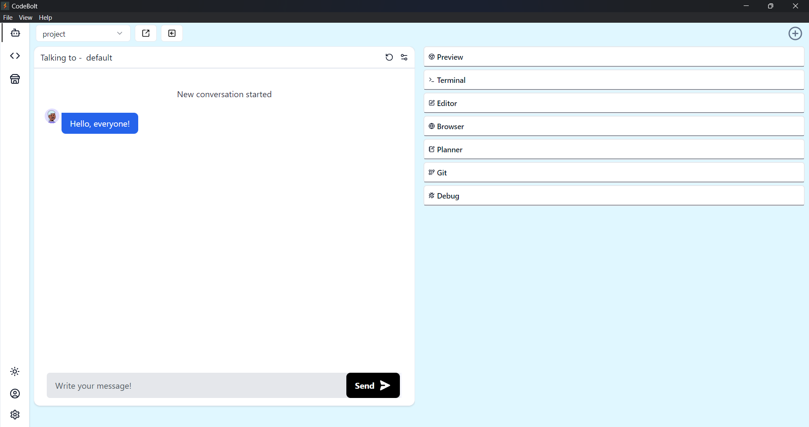

<CBBaseInfo/> 
 <CBParameters/>


### Example

```js
// Send a message through the WebSocket connection
const message = await codebolt.chat.sendMessage("Hello, everyone!");

```




### Explanation

The codebolt.chat.sendMessage(message: string) function is used to send a message  on the codebolt chat . This function enables real-time communication by allowing the script to send text messages on the codebolt chat.