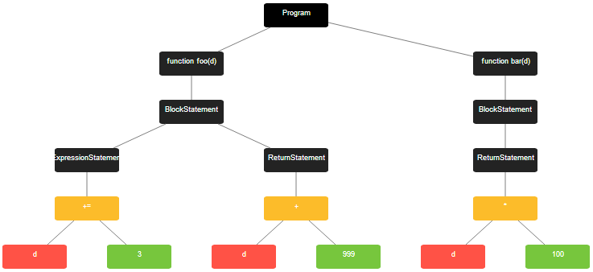

<CBBaseInfo/> 
 <CBParameters/>

### Example

```js

////test.js 

function foo(d) {
  d += 3;
    return d+999
}
function bar(d) {
    return d*100
}


///index.js

const getAllFilesAsMarkDown = await codebolt.codeutils.getAllFilesAsMarkDown();

```



### Explaination 

The codebolt.codeutils.getAllFilesAsMarkDown() function is used the Retrieves all files as Markdown. This Function returns the File as markdown, which we can store in a variable and use.