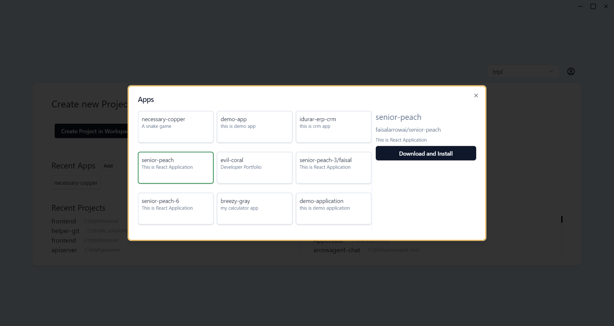
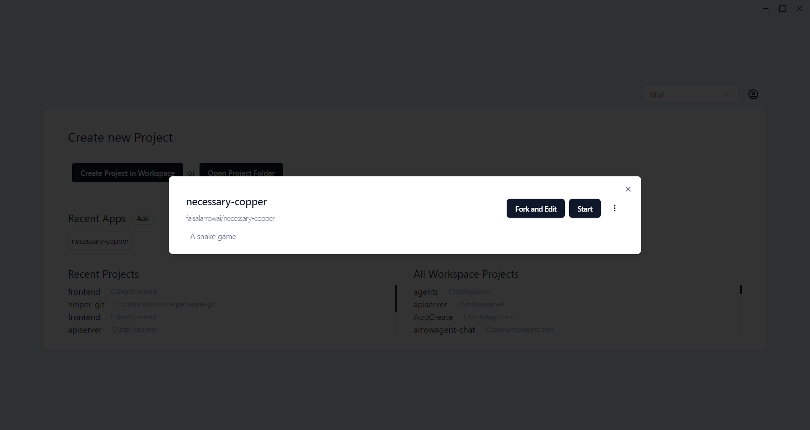

# Apps

This app allows users to create and publish their own applications. It’s designed to be collaborative, enabling other users to explore, modify, and customize existing apps for their purposes. With features like `Start` and `Fork and Edit`, users can easily build upon existing apps to create new functionalities or tailor apps to their specific needs.

**Create a New App**
* You can make your own app from scratch. 

* When your app is ready, you can publish it for others to see and use.

* you can Download Apps from the Marketplace, The Marketplace has many apps shared by other users.

* You can browse, download, and use these apps.

* **Fork and Edit Apps**: you Want to make changes to an app you downloaded? You can fork (copy) and edit it.

