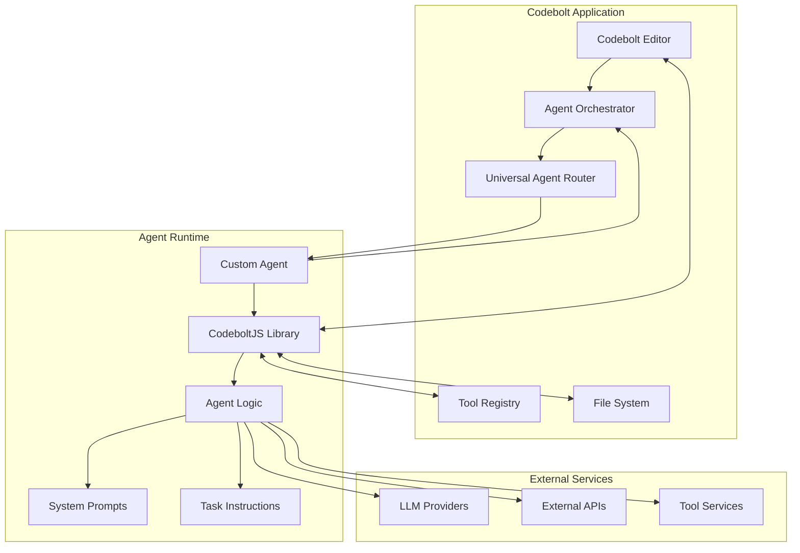

# Agent Introduction

Codebolt is an extremely powerful platform for AI-driven code editing and generation. The core strength of Codebolt lies in its agent-based architecture, where specialized AI agents handle different aspects of software development, from code generation to testing and deployment.

## What is a Codebolt Agent?

A Codebolt Agent is a custom AI-powered application that connects to the Codebolt platform to execute specific development tasks. Think of agents as specialized developers with unique skills - one might excel at React component generation, another at API development, and yet another at testing automation.

### Key Characteristics

- **Specialized**: Each agent focuses on specific development tasks or domains
- **Autonomous**: Agents can make decisions and take actions using LLM reasoning
- **Connected**: Agents integrate seamlessly with the Codebolt application
- **Extensible**: Agents can use tools and call other agents for complex workflows
- **Reusable**: Once created, agents can be shared and used across projects

## How Agents Work

Codebolt agents operate through an agentic process flow that combines:

1. **User Intent Understanding**: Parsing and interpreting user requests
2. **Task Planning**: Breaking down complex tasks into actionable steps
3. **Tool Utilization**: Using available tools and APIs to accomplish tasks
4. **Code Manipulation**: Reading, writing, and modifying code files
5. **Decision Making**: Using LLM reasoning to make intelligent choices
6. **Result Delivery**: Providing feedback and results to users

## Agent Architecture



## Agent Connection Flow

Codebolt agents connect to the platform using the **CodeboltJS library**, which provides a comprehensive set of functions for:

### 1. Communication Layer
```javascript
// WebSocket connection for real-time communication
codebolt.chat.onActionMessage().on("userMessage", async (req, response) => {
    // Handle user messages and respond
});
```

### 2. Tool Integration
```javascript
// Access to platform tools and external services
const tools = await codebolt.tools.listToolsFromToolBoxes(["codebolt", "custom"]);
```

### 3. File System Access
```javascript
// Read, write, and manipulate project files
const fileContent = await codebolt.fs.readFile("./src/component.js");
await codebolt.fs.writeFile("./src/newComponent.js", generatedCode);
```

### 4. LLM Integration
```javascript
// Interact with various LLM providers
const response = await codebolt.llm.chat(messages, tools);
```

## Agent Types and Use Cases

### 1. **Code Generation Agents**
- Generate React components, API endpoints, database models
- Create boilerplate code and project structures
- Implement design patterns and best practices

### 2. **Testing Agents**
- Write unit tests, integration tests, and end-to-end tests
- Generate test data and mock objects
- Analyze code coverage and suggest improvements

### 3. **Deployment Agents**
- Deploy applications to various platforms (Vercel, AWS, etc.)
- Configure CI/CD pipelines
- Manage environment variables and secrets

### 4. **Code Review Agents**
- Analyze code quality and suggest improvements
- Check for security vulnerabilities
- Ensure coding standards compliance

### 5. **Documentation Agents**
- Generate API documentation
- Create README files and user guides
- Maintain code comments and inline documentation

## Agent Lifecycle

### Development Phase
1. **Create**: Use CLI to scaffold agent structure
2. **Configure**: Define SDLC steps, actions, and routing
3. **Implement**: Write agent logic using CodeboltJS
4. **Test**: Run locally and test with Codebolt application

### Deployment Phase
1. **Publish**: Upload to Codebolt registry
2. **Share**: Make available to community or team
3. **Version**: Manage updates and backward compatibility

### Runtime Phase
1. **Discovery**: Users find agents through registry
2. **Installation**: Clone or install agents in projects
3. **Execution**: Agents handle user requests and tasks
4. **Monitoring**: Track performance and usage

## Agent Communication Protocol

Agents communicate with Codebolt through a structured protocol:

```javascript
// Message Structure
{
    type: "userMessage",
    content: "Generate a React component for user profile",
    context: {
        projectPath: "/path/to/project",
        currentFile: "src/App.js",
        selectedText: "...",
        metadata: {...}
    }
}

// Response Structure
{
    success: true,
    message: "Created UserProfile component successfully",
    actions: [
        {
            type: "fileCreate",
            path: "src/components/UserProfile.js",
            content: "..."
        }
    ]
}
```

## Benefits of Agent-Based Architecture

### For Developers
- **Specialization**: Focus on specific domains and use cases
- **Reusability**: Create once, use across multiple projects
- **Collaboration**: Share agents with team and community
- **Extensibility**: Build on existing agents and tools

### For Users
- **Efficiency**: Automated complex development tasks
- **Consistency**: Standardized approaches across projects
- **Learning**: Discover new patterns and best practices
- **Flexibility**: Choose the right agent for each task

### For Organizations
- **Standardization**: Enforce coding standards and practices
- **Knowledge Sharing**: Capture and distribute expertise
- **Productivity**: Accelerate development workflows
- **Quality**: Consistent, tested approaches to common tasks

## Getting Started

Ready to create your first agent? Here's what you need:

1. **Prerequisites**: Node.js, Codebolt CLI, and basic JavaScript knowledge
2. **Quick Start**: Follow our [QuickStart Guide](./quickstart.md) for a 10-minute setup
3. **Deep Dive**: Explore [Agent Architecture](./1_agentarchitecture.md) for detailed concepts
4. **Examples**: Check out [Custom Agents](./3_customagents.md) for real-world examples

## Agent Ecosystem

The Codebolt agent ecosystem includes:

- **Official Agents**: Maintained by the Codebolt team
- **Community Agents**: Created and shared by developers
- **Private Agents**: Custom agents for specific organizations
- **Tool Integration**: Agents that wrap external services and APIs

## Next Steps

- **[QuickStart Guide](./quickstart.md)** - Create your first agent in 10 minutes
- **[Agent Architecture](./1_agentarchitecture.md)** - Understand the technical details
- **[Using Agents](./2_usingagents.md)** - Learn how to effectively use agents
- **[Custom Agents](./3_customagents.md)** - Build specialized agents for your needs

---

Codebolt agents represent the future of AI-assisted development - intelligent, specialized, and collaborative tools that amplify human creativity and productivity in software development.


