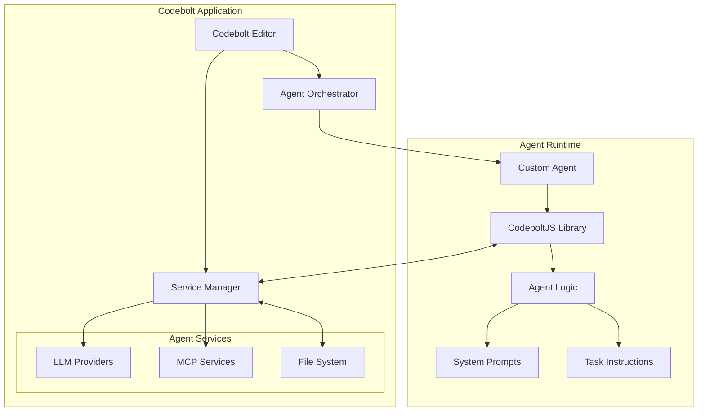
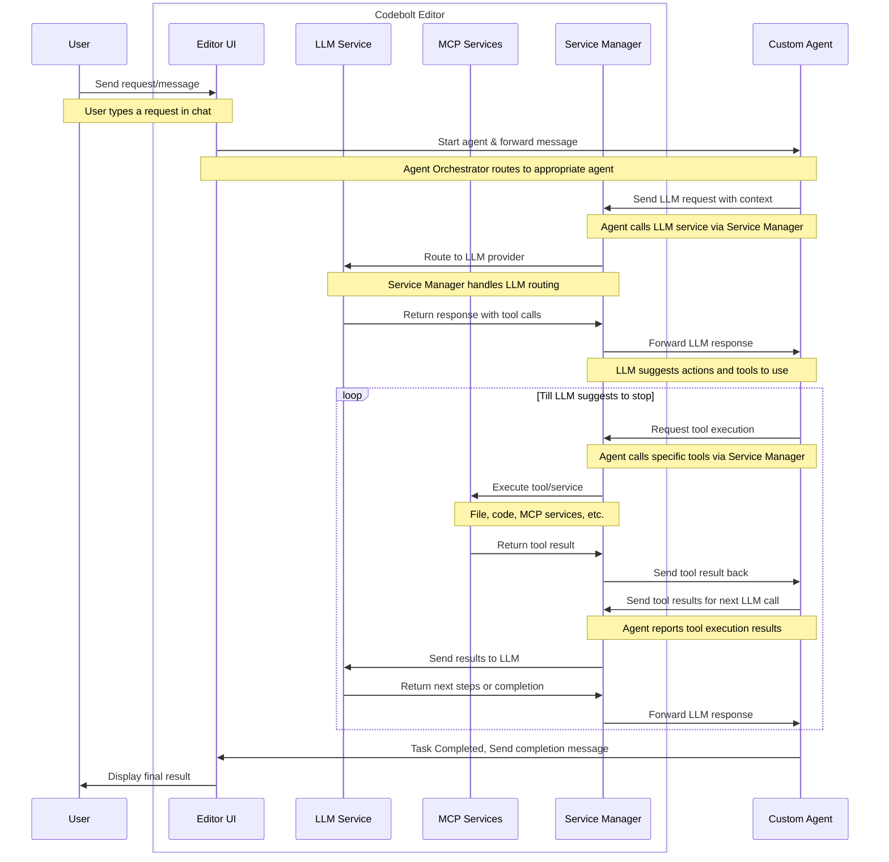

# Overview

Agents are intelligent assistants in Codebolt that can automate tasks, interact with your code, and enhance your development workflow. They use Codebolt's APIs to perform actions in your editor, making them much more powerful than simple prompt-based tools.

## How Agents Work in Codebolt

Agents operate by understanding your intent, planning tasks, and executing actions directly in your development environment. They can read, write, and refactor code, run tests, and even coordinate with other agents to handle complex workflows.

## Agent Architecture

## Agent Flow

The following sequence diagram illustrates the complete flow of how a user request is processed through Codebolt and agents:

## Creating Agents

There are two main ways to create an agent in Codebolt:
- [Custom Agent](./2_custom-agent.md): Build an agent from scratch with your own logic and features.
- [Remix Agent](./3_remix-agent.md): Start from an existing agent and modify it to fit your needs.
