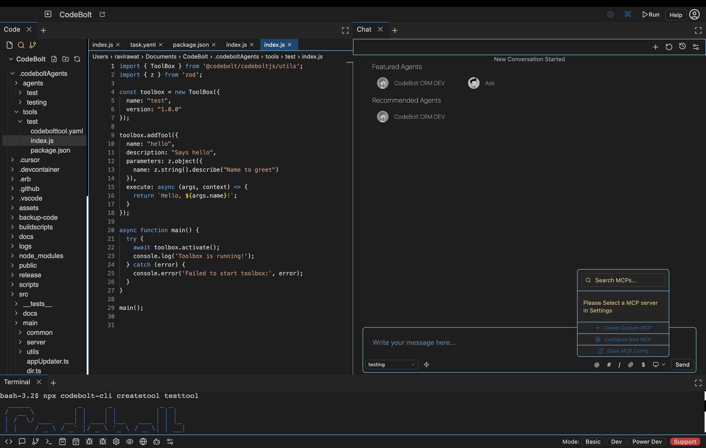
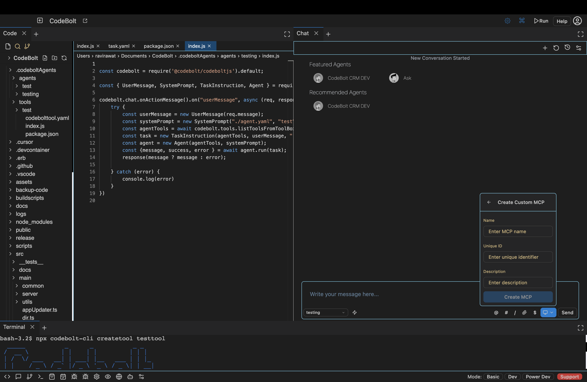
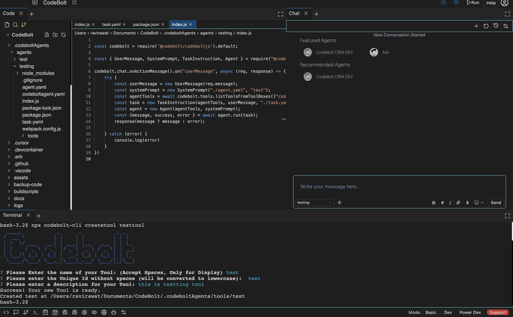
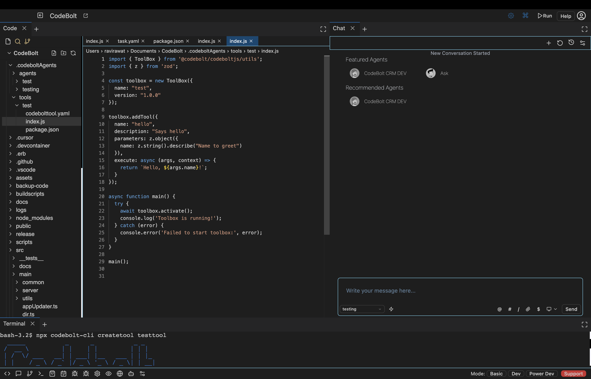

# Creating Your First Tool

This guide walks you through the process of creating and customizing your first Codebolt tool.

## Tool Creation

You can create a new tool using either the Codebolt UI or the CLI:

### Option 1: Using the Codebolt UI

Navigate to the Codebolt dashboard and use the tool creation interface:



Enter a descriptive name for your tool:



### Option 2: Using the CLI

Alternatively, use the Codebolt CLI by running:

```bash
npx codebolt-cli createtool <toolName>
```

Replace `<toolName>` with a descriptive name for your tool.



## Tool Configuration

After creation, your tool will be available in the `.codeboltAgent/tool` directory within your project structure. This directory contains all configuration and implementation files needed for your tool.



## Customization Options

You can customize various aspects of your tool:

- Input parameters and validation
- Processing logic and business rules
- Output formatting and response handling
- Integration with external services

For detailed information on available configuration options, refer to the [Tool Configuration Reference](../reference/tool-configuration.md).

## Testing and Deployment

Once configured, your tool will appear in the Tools section of the Codebolt chat interface. You can:

1. Test the tool's functionality with sample inputs
2. Debug any issues in real-time
3. Refine the tool's behavior as needed
4. Deploy for production use

This iterative development process ensures your tool performs as expected in your application ecosystem.