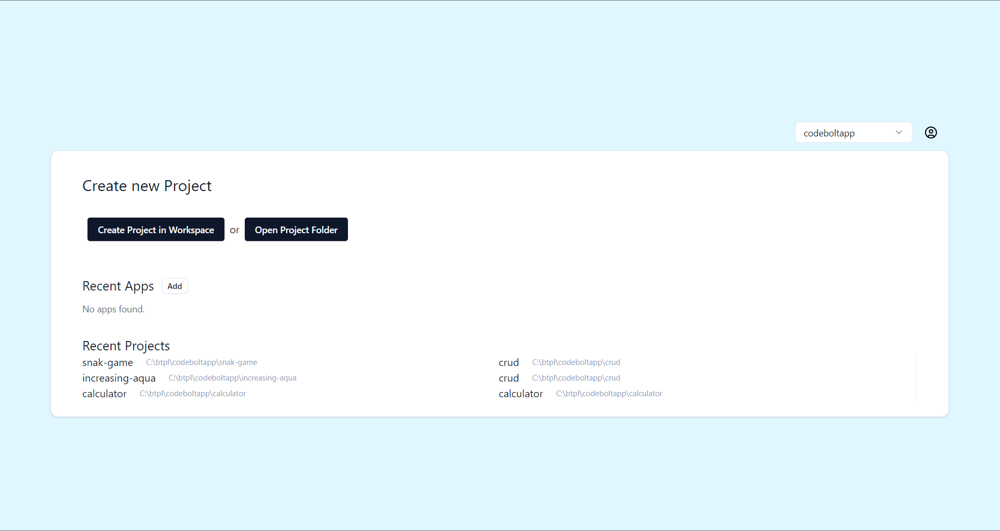
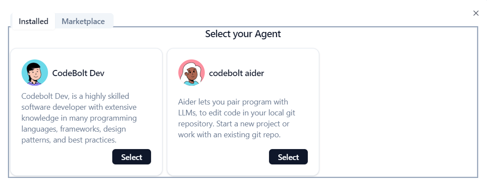
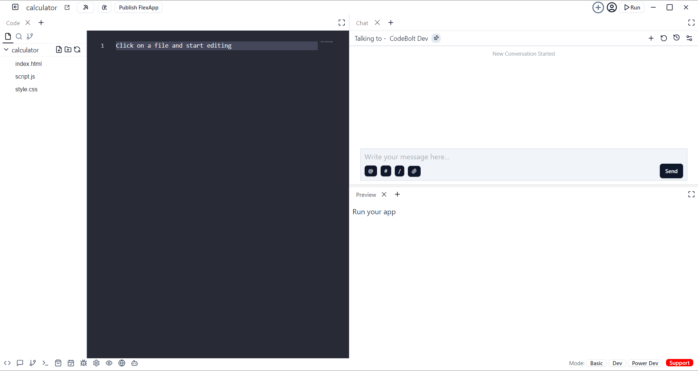

# Overview

### Get Started

Codebolt is a fast, lightweight, and customizable source code editor for Windows and macOS, designed to enhance productivity with intelligent features and extensive language support.
Click on the "Get Started" button. This action initiates the sign-in process, where users are given two options for authentication: Google or GitHub.
<!-- Start your journey with Codebolt by exploring these introductory videos. -->

<!--  -->

<iframe width="100%" height="500" src="https://www.youtube.com/embed/_Ws-C_vKTx0?si=NivrnRfc2nXG1Fxy" title="YouTube video player" frameborder="0" allow="accelerometer; autoplay; clipboard-write; encrypted-media; gyroscope; picture-in-picture; web-share" referrerpolicy="strict-origin-when-cross-origin" allowfullscreen></iframe>

After successfully completing the onboarding process, users can sign in to explore the application dashboard. On the dashboard, users can:

* Create new project in the workspace or open the project folder.
* Access recent projects and files for quick continuation of their work.
* Create new workspace, accessible from the top-right of the dashboard..

### Latest Agents

Bug hunter agents and documentation agents help you work faster and make the platform more powerful.

### First Steps

To get started with CodeBolt, here are some initial steps to familiarize yourself with the editor:

* [Intro Videos](#) - Begin your journey with CodeBolt through introductory videos that showcase its features and capabilities.

* [Setup](#) - Install CodeBolt for your platform and configure the toolset according to your development needs.

* [User Interface](#) - Introduction to the basic UI, commands, and features of the codebolt editor.

* [Settings](#) -  Customize Codebolt for how you like to work.

* [Chat Features](#) - Explore CodeBolt's built-in chat functionality to communicate seamlessly with collaborators.

* [Preview](#) - Utilize the preview feature in CodeBolt to see real-time updates of your code or project output.

* [Terminal](#) - Access and use the integrated terminal in CodeBolt for command-line operations without leaving the editor.

* [Editor](#) - Learn about the powerful editing capabilities of CodeBolt, including syntax highlighting, auto-completion, and more.

* [Browser](#) - Use CodeBolt's built-in browser to test and preview web applications directly within the editor environment.

* [Planner](#) - Organize your tasks and projects effectively with CodeBolt's integrated planner or task management tools.

* [Git](#) - Take advantage of Git integration within CodeBolt for version control, branching, committing, and merging code changes.

* [Debug](#) - Set up and debug your applications seamlessly using CodeBolt's debugging tools and features.

### Downloads
* [Download Codebolt](https://codebolt.ai/) - Quickly find the appropriate install for your platform (Windows, macOS)

