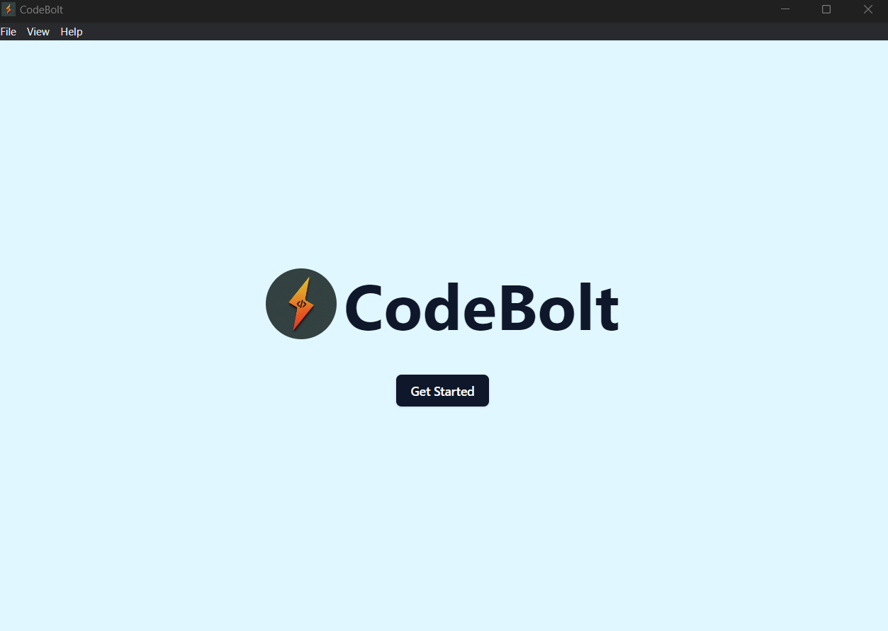
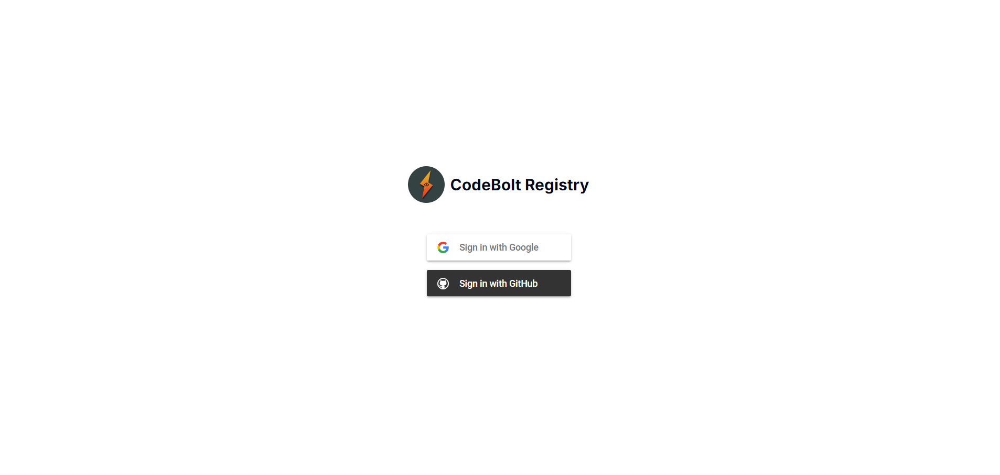
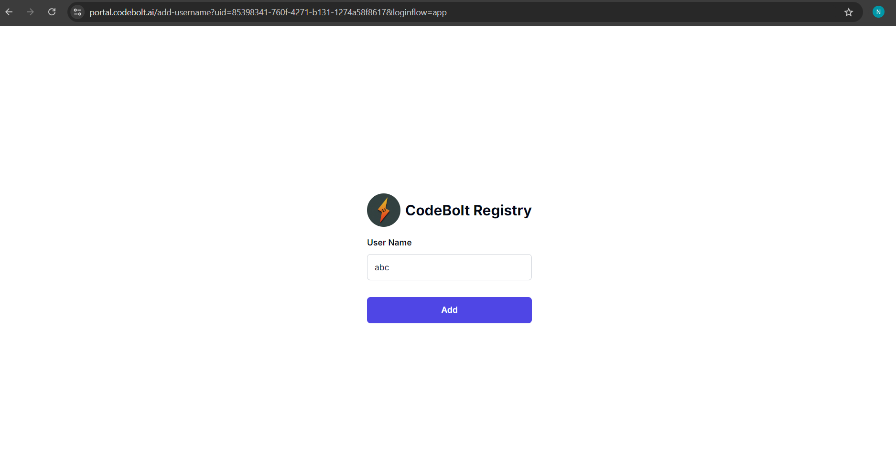
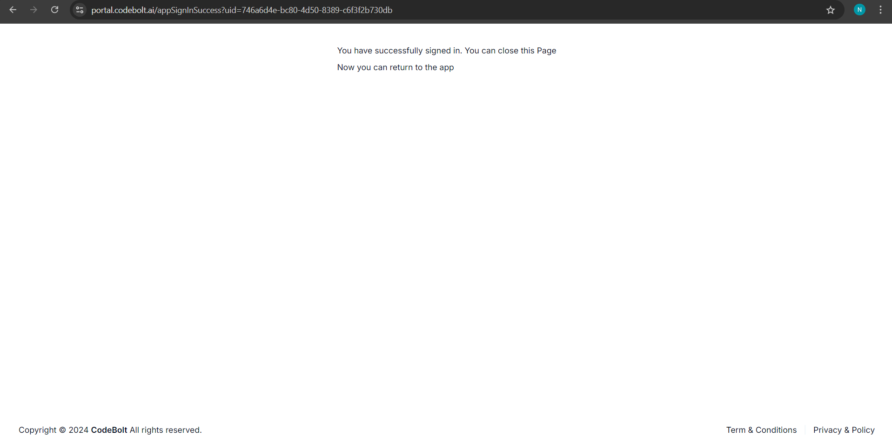
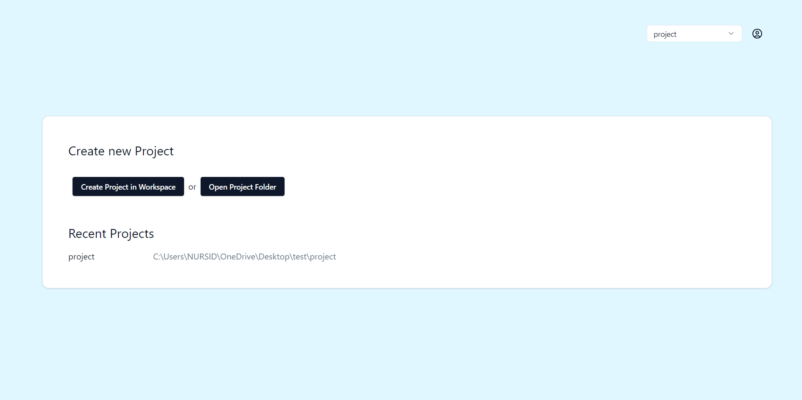

# Onboarding

### Step 1: Getting Started
Begin by clicking the **Get Started** button on the home page.

### Step 2: Sign Up
Once you click **Get Started**, you will be redirected to the portal for **Sign Up**.

Here, you will have two options for signing up:
- **Google**
- **GitHub**

### Step 3: Authentication
- **If you choose Google or Github**:
  - You will be redirected to Google's or Github authentication page for authentication.
  - If you are a new user, you will be redirected to the username page.
You need to create and add a username. After adding the username, you can proceed further.

- After successful authentication, a message will appear:  
    *"You have successfully signed in. You can close this Page, Now you can return to the app"*
  - Once the authentication process is completed, you can proceed to use the application.

After successfully completing the onboarding process, users can sign in to explore the application dashboard. On the dashboard, users can:

* Create new project in the workspace or open the project folder.
* Access recent projects and files for quick continuation of their work.
* Create new workspace, accessible from the top-right of the dashboard..

