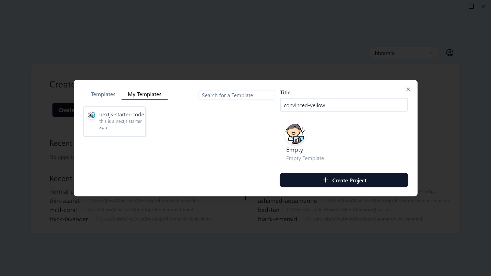

# My Templates

Streamline Your Workflow with Custom Templates: Codebolt enables users to upload their own project templates directly to their Codebolt portal. This powerful feature is designed for professionals who regularly initiate projects with specific structures or configurations.

Seamless Integration with Codebolt: Once uploaded, your custom templates are seamlessly integrated into the Codebolt app, empowering you to kickstart new projects efficiently while leveraging your personalized settings and configurations.

## Video Guide

<iframe width="100%" height="315" src="https://www.youtube.com/embed/WCr68gOgiuw?si=WNd53WSaQ0AtKiku" title="YouTube video player" frameborder="0" allow="accelerometer; autoplay; clipboard-write; encrypted-media; gyroscope; picture-in-picture; web-share" referrerpolicy="strict-origin-when-cross-origin" allowfullscreen></iframe>