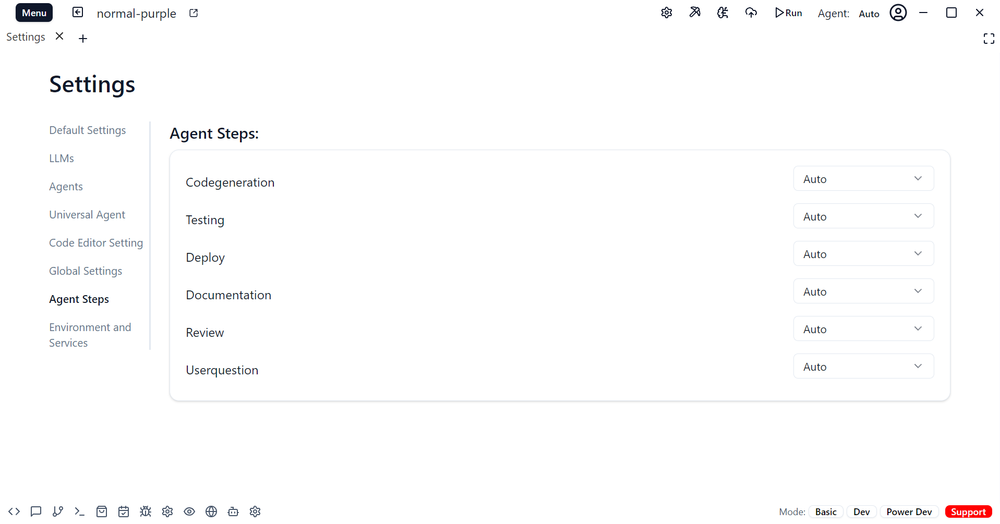

The Agent Steps feature in Universal Agent allows you to define a sequence of up to six steps that the AI assistant will follow when working on a task. These steps can include:

1. Code Generation
2. Testing
3. Deployment  
4. Documentation
5. Code Review
6. User Questions

For each step, you can specify which particular agent should be used. This allows you to customize the workflow and leverage the strengths of different AI models based on the task at hand.

If no agent is explicitly set for a step, Universal Agent will automatically select the most appropriate agent based on the nature of the step and the context provided. This ensures that the optimal AI model is used for each phase of the development process.

By breaking down the workflow into discrete steps and assigning specialized agents to each one, the Agent Steps feature streamlines the development process and helps ensure high-quality output at every stage.

### Advanced Usage

For each step, you can define more than one agent in a priority list. If the first agent is not able to complete the step satisfactorily, Universal Agent will automatically try the next agent in the list for that same step. This provides additional flexibility and redundancy in case a particular AI model is not well-suited for a given task or context.

### Video Guide

<iframe width="100%" height="315" src="https://www.youtube.com/embed/OzxfDPsTtb4?si=W2ntUU05P200gpPe" title="YouTube video player" frameborder="0" allow="accelerometer; autoplay; clipboard-write; encrypted-media; gyroscope; picture-in-picture; web-share" referrerpolicy="strict-origin-when-cross-origin" allowfullscreen></iframe>