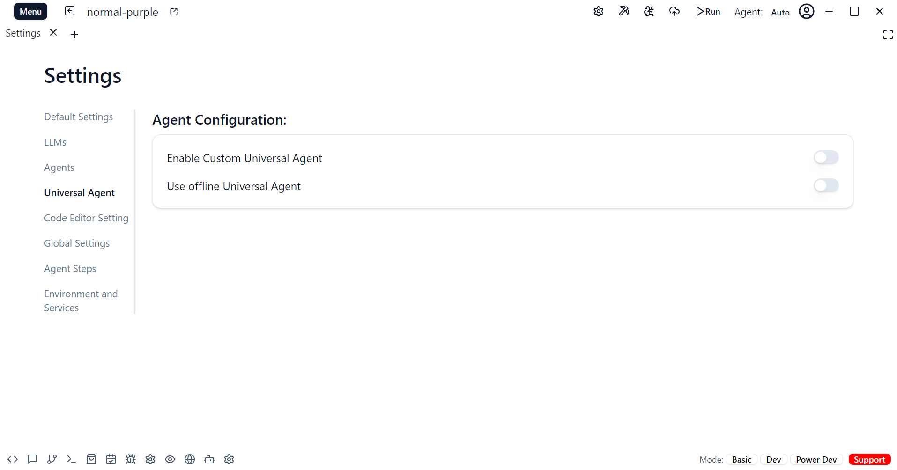

### Universal Agent
- In the **Universal Agent** section, you get two settings:
  - Enable custom  Universal Agent
  - Use offline Universal Agent

## Enable Custom Universal Agent  

When you enable this option, you will need to provide the URL of your own custom-made and deployed Universal Agent. This allows you to integrate a personalized AI assistant into the application.

To help guide you through the process of creating and deploying your own Universal Agent, we recommend watching the video tutorial below:

<iframe width="100%" height="315" src="https://www.youtube.com/embed/MXQM9l-PPr4?si=_Lo8-U-u4mj0PVoX" title="Creating a Custom Universal Agent" frameborder="0" allow="accelerometer; autoplay; clipboard-write; encrypted-media; gyroscope; picture-in-picture; web-share" referrerpolicy="strict-origin-when-cross-origin" allowfullscreen></iframe>

Once you have successfully created and deployed your Universal Agent, simply enter the provided URL into the designated field within the application settings. The app will then establish a connection and begin utilizing your custom Universal Agent for enhanced functionality and personalized interactions.

## Use Offline Universal Agent

When you enable this option, the application will use the Universal Agent that is stored locally within the app itself. This means you can access the Universal Agent's functionality even without an internet connection, as it operates entirely offline.