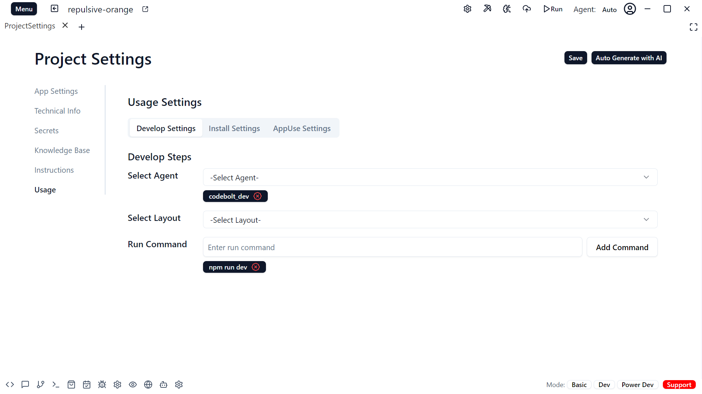
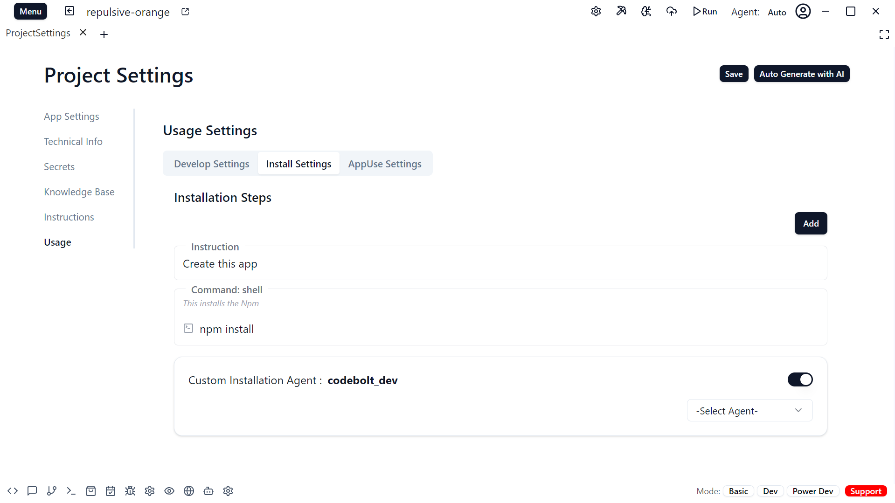
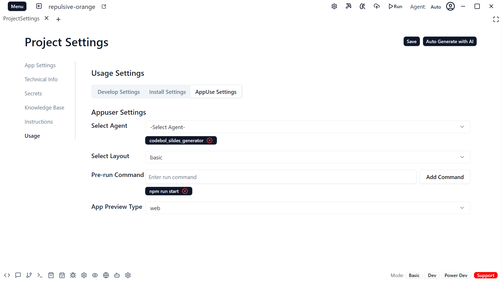

# Usage

Usage settings are divided into three parts:
1. Develop Settings 
2. Install Settings
3. App Use Settings

## Develop Settings

The Develop Settings section provides three options:
1. Select Agent: Choose the appropriate agent for your project.
2. Select Layout: Pick from Basic, Developer, or Power Developer layouts based on your needs.
3. Run Command: Specify any commands to run during the development process.

When user publish their projects as app then to develop on top of this this project they need to know what agent will be best suited what are step to run the project.

## Install Settings

The Install Settings section provides instructions and commands to install the app. It includes:
1. Installation Instructions: Step-by-step guide on how to install the app.
2. Installation Command: Specify the command(s) needed to install the app, such as `npm install` or `pip install`.

When a user wants to install and use an app created from this project, they will refer to this section for the necessary installation details and commands.

## App Use Settings

The App Use Settings section provides options for users to configure how to use the app:
1. Select Agent: Choose the appropriate agent for running the app.
2. Select Layout: Pick the layout that is best suited for the app, such as Basic, Dev, or PowerDev.
3. Pre-run Commands: Specify any commands that need to be run before starting the app.
4. App Preview: Select whether to preview the app locally or on the web.

These settings allow users to customize the app's runtime environment, UI layout, initialization steps, and preview mode to best fit their needs when using the app created from this project.