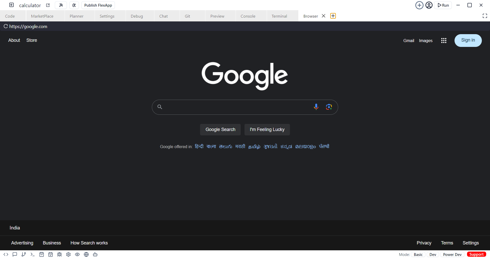

# Browser

CodeBolt's built-in browser lets you test and preview web applications directly in the editor. You can view and interact with your project without switching applications. This feature provides real-time feedback, instant previews, and lets you debug, test different screen sizes, and check cross-browser compatibility, all within CodeBolt. It helps you stay focused and productive by keeping everything in one place.

