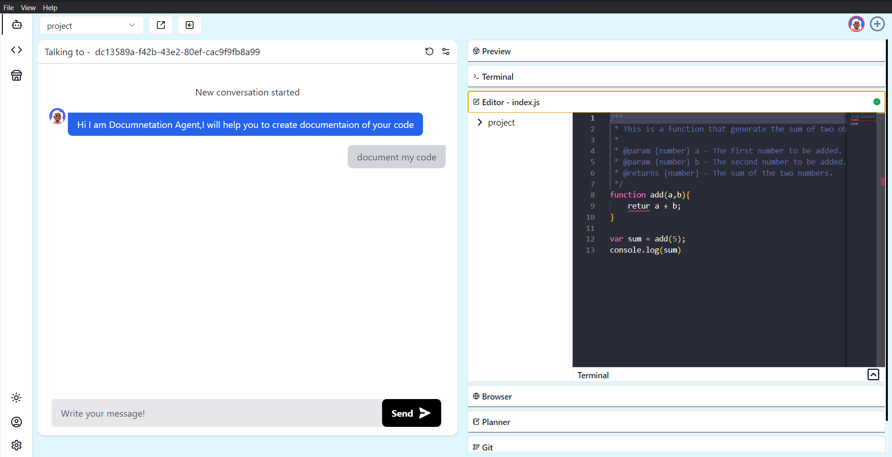

# Editor 

An editor is a software tool that helps developers write, change, and save their code. It's like a workspace where they can manage their projects and make coding easier. These editors come in different types: some are basic and just highlight code for clarity, while others are more advanced and include tools for debugging, keeping track of changes, and organizing projects. They're really important for developers because they create a space where coding in different languages and frameworks is smooth and efficient.

