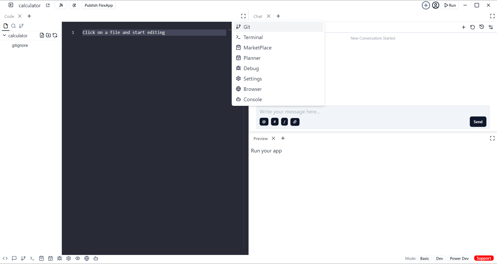

# Chat

Use CodeBolt's built-in chat to get help from Agent AI. Start a new conversation to ask questions, solve problems, and get coding advice instantly. Agent AI assists with coding issues and project guidance, making troubleshooting faster and easier.

### Chat Features

* Select Agents: Located in the top-right of the application, identified by the (+) symbol.  

* Automated project commits to GitHub

* Agent resets

* [Preview](#) - Utilize the preview feature in CodeBolt to see real-time updates of your code or project output.

* [Terminal](#) - Access and use the integrated terminal in CodeBolt for command-line operations without leaving the editor.

* [Editor](#) - Learn about the powerful editing capabilities of CodeBolt, including syntax highlighting, auto-completion, and more.

* [Browser](#) - Use CodeBolt's built-in browser to test and preview web applications directly within the editor environment.

* [Planner](#) - Organize your tasks and projects effectively with CodeBolt's integrated planner or task management tools.

* [Git](#) - Take advantage of Git integration within CodeBolt for version control, branching, committing, and merging code changes.

* [Debug](#) - Set up and debug your applications seamlessly using CodeBolt's debugging tools and features.