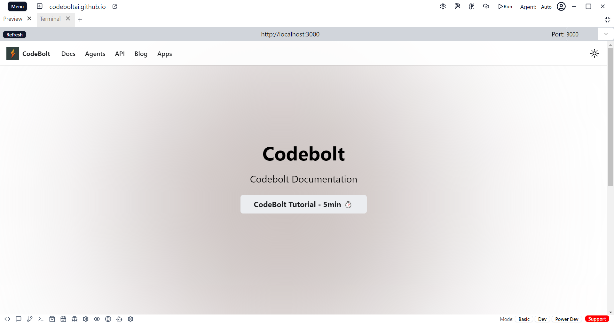

# Preview

 - The Preview feature allows you to view the real-time output of the code you are working on within the application.
 - After writing or editing code, you can use the Preview tab to see how your application or script will look or behave when executed.

 