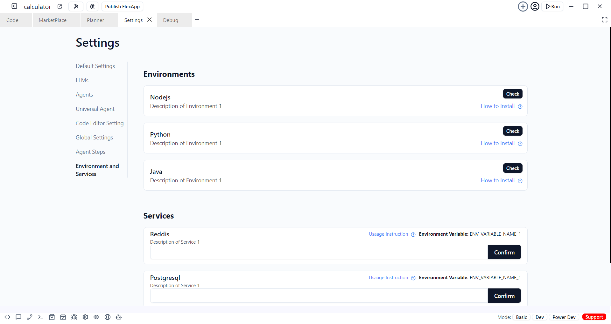

# Setting

 - Customize app settings, including:
 - Default LLM (Large Language Model) selection.
 - Switch between different LLM providers.
 - Choose default agents and modify selections.
 - Manage environment settings for languages (Node.js, Python, Java) and databases (MongoDB, PostgreSQL, etc.).

 