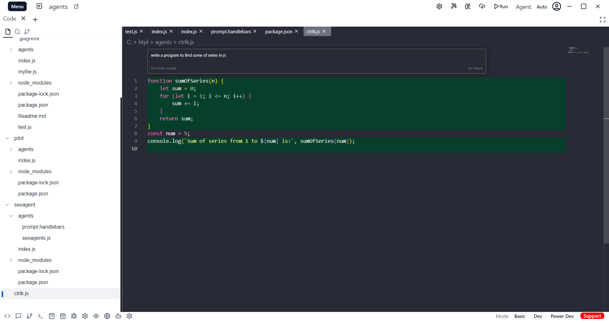

# Ctrl K

Ctrl K lets you edit and write code with the codebolt AI. To edit, try selecting some code, click "Edit," and describe how the code should be changed. To generate completely new code, just type Ctrl K without selecting anything.

 
