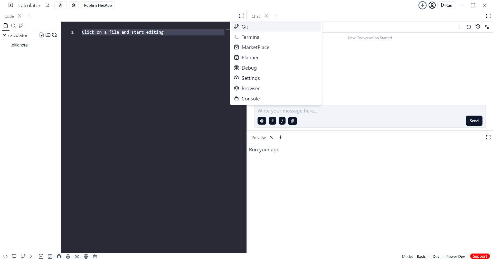

# Modules 

Use CodeBolt's built-in chat to get help from Agent AI. Start a new conversation to ask questions, solve problems, and get coding advice instantly. Agent AI assists with coding issues and project guidance, making troubleshooting faster and easier.

<!-- ### Chat Features -->

<!-- * Select Agents: Located in the top-right of the application, identified by the (+) symbol.  

* Automated project commits to GitHub

* Agent resets

* [Preview](#) - Utilize the preview feature in CodeBolt to see real-time updates of your code or project output.

* [Terminal](#) - Access and use the integrated terminal in CodeBolt for command-line operations without leaving the editor.

* [Editor](#) - Learn about the powerful editing capabilities of CodeBolt, including syntax highlighting, auto-completion, and more.

* [Browser](#) - Use CodeBolt's built-in browser to test and preview web applications directly within the editor environment.

* [Planner](#) - Organize your tasks and projects effectively with CodeBolt's integrated planner or task management tools.

* [Git](#) - Take advantage of Git integration within CodeBolt for version control, branching, committing, and merging code changes.

* [Debug](#) - Set up and debug your applications seamlessly using CodeBolt's debugging tools and features. -->

#### [Git](./git)

 - Perform Git operations like commits.
 - Auto-commit functionality.
 - Manage version control through the chat interface.

#### [Terminal](./terminal)

 - Execute command-line operations directly within the chat.
 - Interact with system processes, run scripts, and perform CLI tasks.

#### [MarketPlace](./marketplace)

 - View available agents in the marketplace.
 - Install new agents.
 - View and manage installed agents.

#### [Planner](./planner)

 - Plan and organize tasks.
 - Mark tasks as completed.
 - Track ongoing and completed tasks for better productivity.

#### [Debug](./debug)

 - View token usage details.
 - Monitor AI model usage and associated costs.
 - Inspect debug information related to AI models.

#### [Settings](./settings)

 - Customize app settings, including:
 - Default LLM (Large Language Model) selection.
 - Switch between different LLM providers.
 - Choose default agents and modify selections.
 - Manage environment settings for languages (Node.js, Python, Java) and databases (MongoDB, PostgreSQL, etc.).

#### [Browser](./browser)

 - Access a built-in web browser to view and interact with web content directly from the chat interface.

#### [Console](./console)

 - View console output.
 - Monitor and debug application processes and operations within the chat.

#### [Preview](./preview) 
 - The Preview feature allows you to view the real-time output of the code you are working on within the application.
 - After writing or editing code, you can use the Preview tab to see how your application or script will look or behave when executed.
