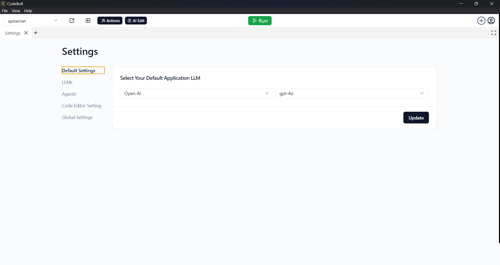
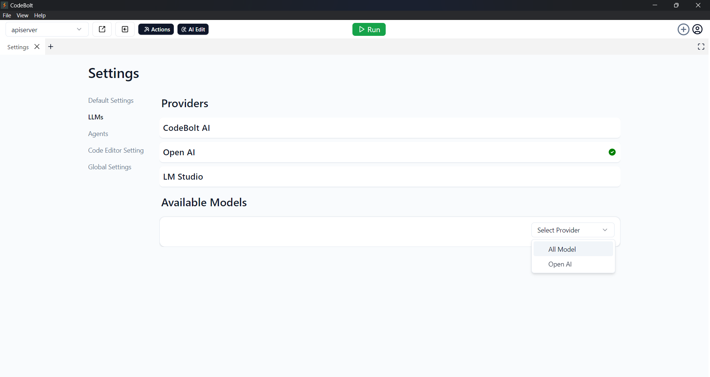
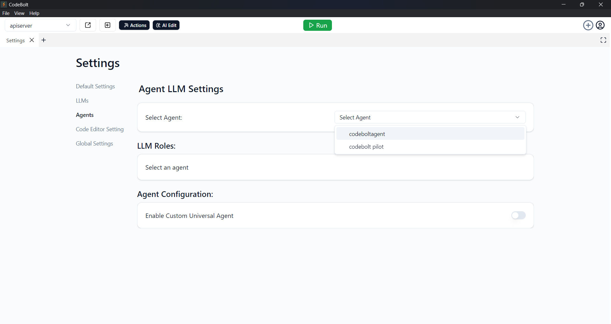

# Application Settings

In the **Application Settings**, you can configure various options to tailor the experience according to your needs. Below are the available settings:

### 1. Default Settings
- In the **Default Settings**, you can set up the application's **LLM** and select a **Model**.

### 2. LLMs
- The **LLMs** setting allows you to select providers. The following providers are available:
  - **CodeBolt AI**
  - **OpenAI**
  - **LM Studio**
- Additionally, you can explore and choose from the **Available Models** within each provider.

### 3. Agents
  - In the Agents section, you can manage agent LLM setting.
  - You can assign LLM Roles to your agents to define their roles.
  - You can also configure your agent by enabling a button that lets you add your own custom agent URL.

### 4. Code Editor Setting
- In the **Code Edit Agent**, you can select agents that support Ctrl+K or Cmd+K functionalities.

### 5. Global Settings
- In **Global Settings**, you can change the background color of the application.
