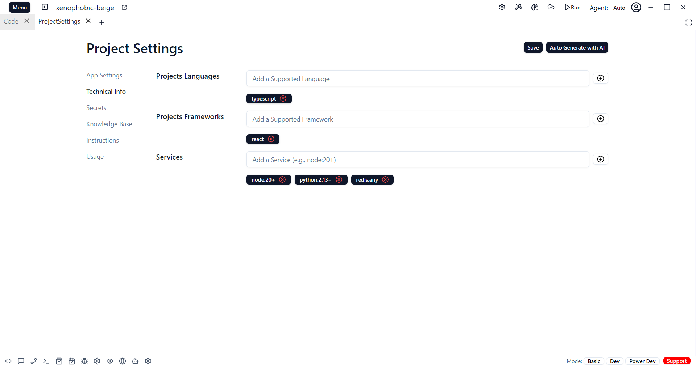
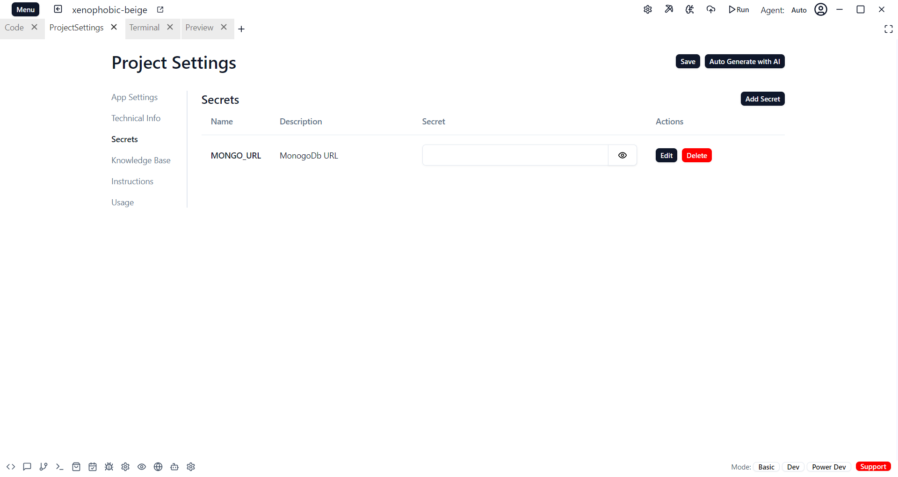
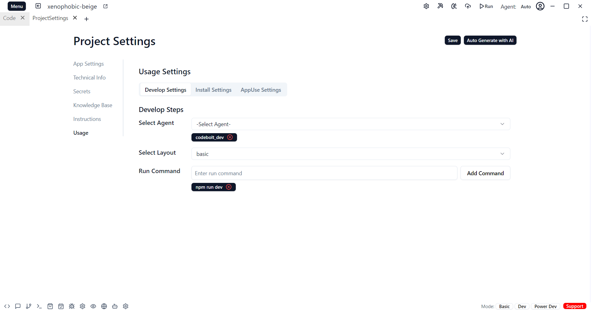
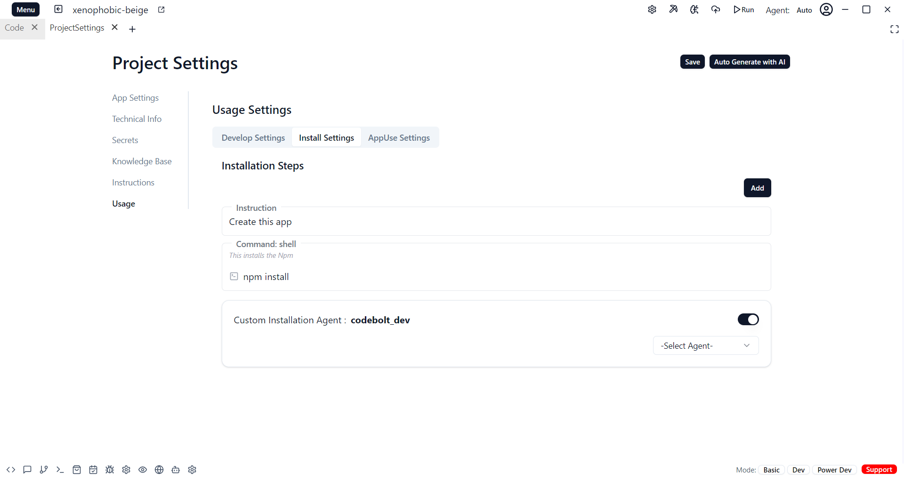
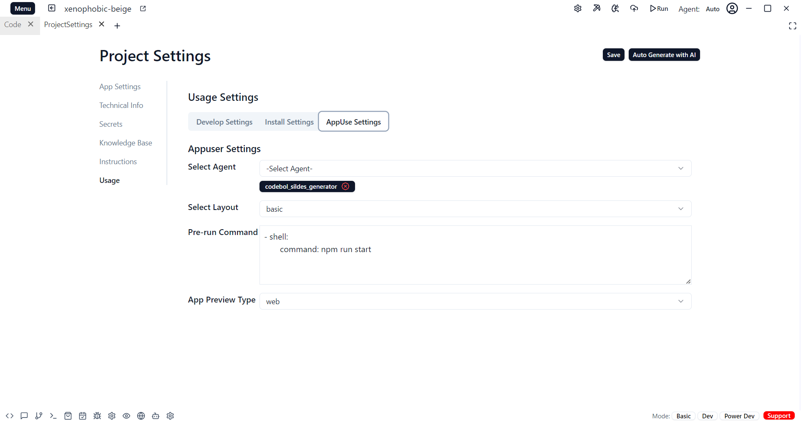

# Project Setting

The Project Settings module allows you to configure essential project parameters, technical details, secrets, knowledge base, instructions, and usage preferences. Each section within Project Settings serves a unique purpose, providing organized control over the project's configuration.

### App Settings
The App Settings section is where you define key details about your application:

* App Name: The name of your application, displayed in the project dashboard and settings.
* App Unique ID: A unique identifier for the app, used for integration and project management.
* App Description: A short description of the app’s purpose or functionality.
* App GitHub Repo URL: The link to the application's GitHub repository, allowing easy access to the project’s codebase.

### Technical Info
The Technical Info section provides information about the technology stack used in the project:

* Project Language: Specifies the primary programming language (e.g., JavaScript, Python).
* Project Framework: Defines the main framework used in the project (e.g., React, Express).
* Services: Lists any services integrated within the project, such as databases, APIs, or external tools.

### Secrets
The Secrets section is used to store and manage sensitive information:

* Add Secret: Allows you to securely add new secrets, such as API keys or passwords.
* List Secrets: Displays a list of all stored secrets for easy access and management

### Knowledge Base
The Knowledge Base section serves as a repository for important information related to the project:

* Add Knowledge Base Entry: Allows you to add entries to the knowledge base with relevant information, documentation, or FAQs.
* List Knowledge Base Entries: Displays all knowledge base entries, with options for editing or deletion.
* Actions: Each entry has actions available for updates or adjustments.

### Instruction
There are two ways to add instructions in this section:

* Text Instruction: Use this option to add written instructions directly in text format.

* Local File Instruction: Allows you to upload instructions in the form of files from your local system.

### Usage Settings

The Usage section offers various settings to define how the application is used and configured. It includes the following sub-sections:

**Develop Settings**
* Add Agent: Enables adding new development agents to assist with various tasks.
* Layout Settings: Customize the layout and organization of the project environment.
* Run Command: Define commands used to run or test the application in development mode.

**Install Settings**
* Install Custom Agent: Allows installation of custom agents designed for specific tasks or integrations within the project.

**App Use Settings**
* Customize how the app is used, with options to manage user roles, permissions, or usage guidelines specific to the application.

