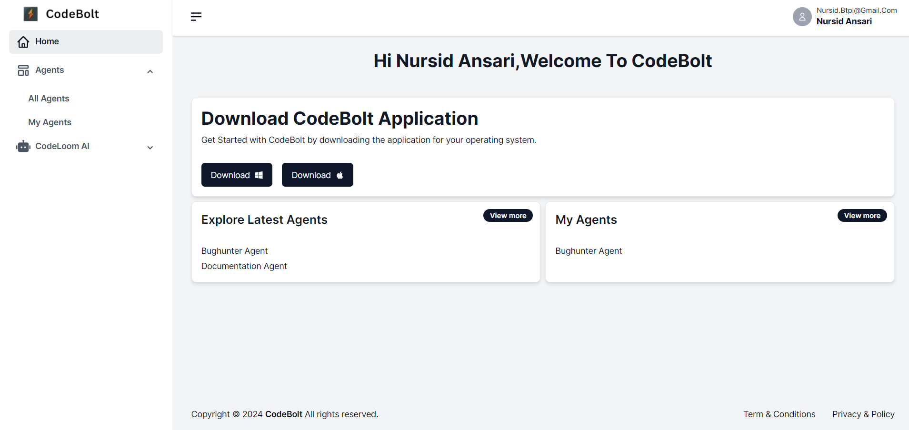
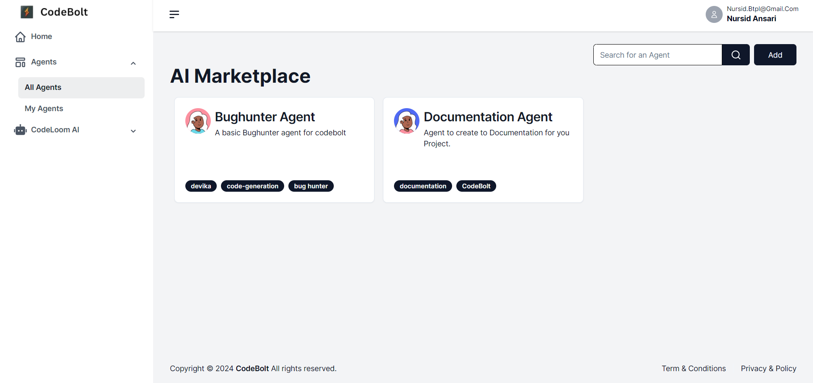
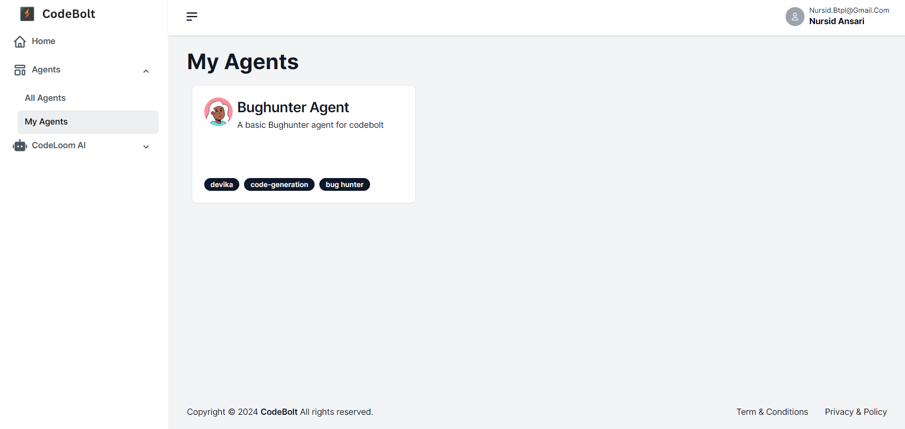

# Overview

### Getting Started
To begin the onboarding process, users need to click on the "Get Started" button. This action initiates the sign-in process, Upon successful authentication, they will be redirected to the Codebolt portal.

### Exploring the Registry
Once logged in, users will land on the Codebolt home page. The registry provides an overview of Add agents, exploring latest agents, download the codebolt application:

### Explore Latest Agents: 

Bug hunter agents, Documentation agents ,Enhance your productivity with specialized agents designed to streamline your workflow and expand the platform's capabilities.

### My Agents:

users can exlpore all the agents they have created or are currently using. It allows users to manage their agents, including updating, modifying, or deploying them as needed. Additionally, users can explore and add new agents.

### Download the Application: 

[Download](https://codebolt.ai/)  User can download the application for windows and mac operating system.

<!-- **Codebolt** is a Code Editor, with focus on AI Agents. It allows for software developers to use AI Agents for multiple things from code generation to testing, depoloyment and documentation. The Codebolt Agents are the building blocks of the Codebolt Platform. 

## Codebolt Agents
Codebolt Agents are  -->
<!-- - completion, 
- generation, 
- review, 
- analysis, 
- refactoring, 
- testing, 
- debugging, 
- profiling, 
- optimization, 
- security, 
- monitoring, 
- deployment, 
- integration, 
- collaboration, 
- documentation, 
- visualization, etc. -->