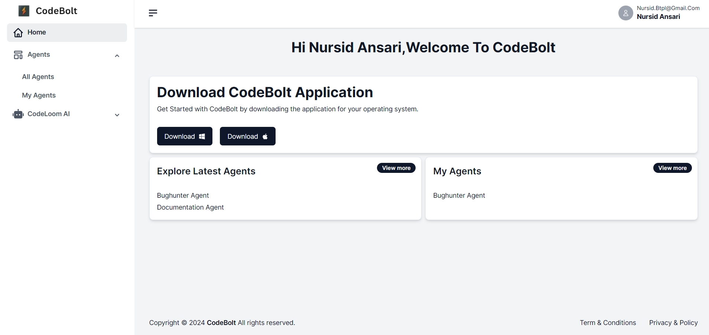

Onboarding is a crucial initial step in familiarizing users with a platform. It involves guiding them through the setup process and helping them understand how to use the platform's features effectively. In the context of our platform, onboarding starts with user authentication.

### Getting Started
To begin the onboarding process, users need to click on the "Get Started" button. This action initiates the sign-in process, where users are given two options for authentication: Google or GitHub.

### Sign-In with Google:

* When selecting Google, users will be redirected to Google's login page.
* sers need to enter their Google credentials (email and password).
* Upon successful authentication, they will be redirected to the Codebolt portal.

### Sign-In with GitHub:

* If users opt for GitHub, they will be taken to GitHub's login page.
* Users must provide their GitHub credentials to log in.
* Successful authentication will also redirect users to the Codebolt portal.

### Exploring the Dashboard
Once logged in, users will land on the Codebolt home page. The dashboard provides an overview of Add agents, exploring latest agents, download the codebolt application:

